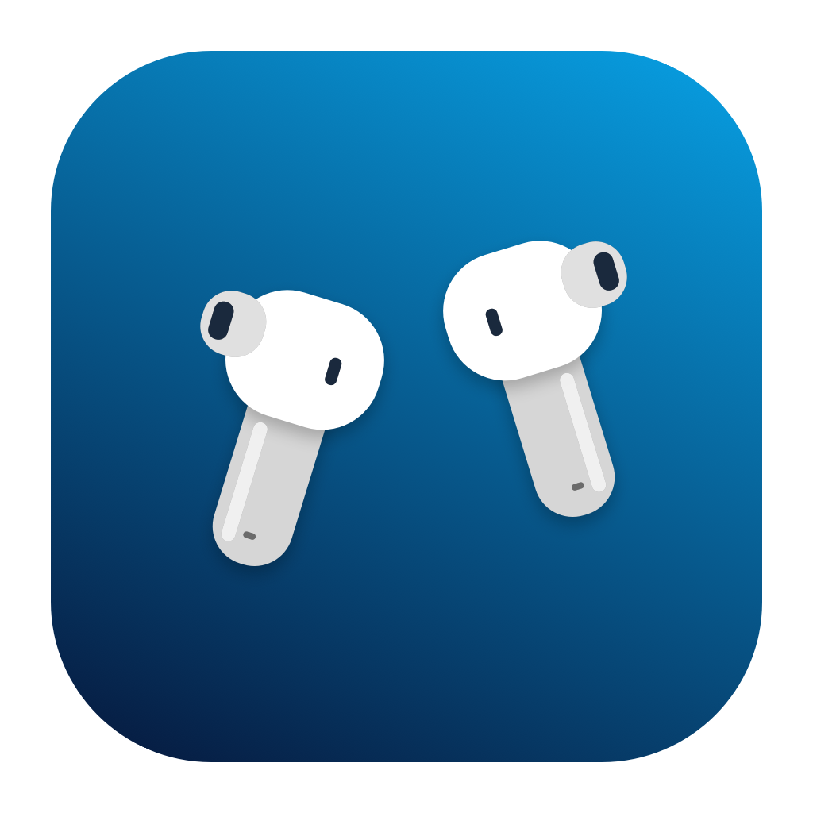

# Enco X3 for Mac

独立的原生 macOS 菜单栏应用，使用 Swift/SwiftUI、AppKit 和 IOBluetooth RFCOMM 控制 **OPPO Enco X3（PID 067410）**。不依赖 Electron、Python、后台服务器或手机中转。

## 下载与安装

**[下载最新版安装包](https://github.com/JonathanChan-geek/EncoX3-Mac/releases/latest)** · [安装说明](docs/INSTALL.zh-CN.md)

下载 Apple Silicon（arm64）DMG，打开后将 `Enco X3.app` 拖入 `Applications`。也提供 ZIP 和 SHA-256 校验文件。当前没有 Intel 成品包。

本版为 ad-hoc 签名，**未经过 Developer ID 签名或 Apple 公证**；首次打开可能需要按 [Apple 官方说明](https://support.apple.com/102445) 在“隐私与安全性”中选择“仍要打开”。启动后允许蓝牙访问即可使用。

## 已完成并实机验证

| 功能 | 当前支持 |
|---|---|
| 左耳、右耳、充电盒电量 | 百分比与充电标志；未上报显示 `--` |
| 降噪与通透 | 关闭、固定通透、自适应通透、智能/深度/中度/轻度降噪 |
| EQ | 至臻原音、高清解析、纯享人声、澎湃低音、丹拿特调、自定义预设切换 |
| 耳机空间音效 | 关闭、固定、跟随 |
| 双设备 | 读取耳机报告的连接设备名称及状态；不改变连接或优先级 |
| 状态同步 | 设备通知 + 定期查询、打开面板刷新、失联重试、唤醒后重新查询 |

所有控制默认开放，但只对型号确认、通道正常且相关读数新鲜的设备启用。成功须收到成功 ACK **并精确回读目标值**；超时、拒绝、归一化均不冒充成功。

2026-09-23 本机实测：7 种降噪状态、6 个 EQ 预设、3 种空间模式逐项通过；测试后恢复 **降噪关闭 / EQ 自定义 / 空间关闭**，自定义 EQ 频率和增益未改变。详情见 [验收记录](docs/evidence/2026-09-23-audio-verified.md) 与 [降噪记录](docs/evidence/2026-09-23-anc-verified.md)。这些是协议与状态验证，没有进行声学测量；模式名称来自 X3 型号配置，自定义名称来自设备回包。

## 界面



0.2.2 加入正式应用图标及菜单栏耳塞图标；GUI 蓝牙操作采用异步回调与超时定时器，连接和查询期间不阻塞面板。开发 App 产物保存在隐藏的 `.build/apps/`，避免与安装版一起出现在 Spotlight。

0.2.3 将菜单栏图标换为 macOS 原生入耳式耳机矢量符号，保留耳塞和音腔细节，并按比例调整到 24 × 18 pt，随系统自动切换深浅颜色。

本机最终版启动实测：面板显示调用完成 0.452 秒，控制通道打开 2.834 秒，完整状态读回 3.384 秒。耗时取决于系统蓝牙初始化、权限和耳机状态，不是所有机器的保证值。见 [0.2.2 验收记录](docs/evidence/2026-09-23-v022-acceptance.md)。

0.2 版参考 Apple AirPods 与 HeyMelody 的信息层级重新设计：耳机/盒子电量展示、四模式图标选择、降噪强度分段控件、整行音效菜单及紧凑双设备列表。界面跟随系统深浅外观。设计研究和来源见 [视觉设计记录](docs/design/2026-09-23-ui-redesign.md)。

## 使用

1. 先在 macOS 蓝牙设置中连接 OPPO Enco X3。
2. 打开 `Enco X3.app`，点击菜单栏耳机图标查看状态和控制。
3. 若系统询问蓝牙权限，允许应用访问；若首次没有数据，可在“系统设置 → 隐私与安全性 → 蓝牙”检查权限。

充电盒休眠时可能不报告电量。本次只开盖仍无盒电量，**一只耳机入盒并保持开盖**后成功读到。界面不会拿历史盒电量冒充实时值。

应用只打开自己的控制通道，不主动配对、取消配对或断开系统音频连接；不恢复出厂、不更新固件。使用菜单栏控制会保留你主动选择的设置；只有诊断轮转测试会自动恢复测试前设置。

## 构建与安装

本机验收环境：Apple Silicon、macOS 27.2 (26B5091g)、Swift 6.4 / Command Line Tools。最低部署目标 macOS 13，**其他系统和固件尚未实机验证**。

```bash
swift run EncoCoreChecks   # 独立的离线协议/恢复逻辑校验
./build.sh                # Release 构建、打包、ad-hoc 签名与校验
./scripts/install.sh      # 仅安装主应用到 /Applications；--with-probe 可选诊断工具
./scripts/package-release.sh # 构建 DMG / ZIP / SHA256SUMS 到 release/v<版本>/
open "/Applications/Enco X3.app"
```

产物为 `.build/apps/Enco X3.app` 和 `.build/apps/Enco Probe.app`。仅本地 ad-hoc 签名，未做 Developer ID 签名或 Apple 公证。本机只有 CLT、缺少 XCTest，因此采用无依赖 executable checks；不声称 `swift test` 已通过。

可选 `--diagnostics` 在 stderr 输出最小连接/状态日志。旧参数 `--enable-verified-anc`、`--enable-audio` 仅兼容保留，已不影响功能开关。应用与 Probe 不宜同时占用控制通道。

## 诊断工具

```bash
# 只读：配对设备和缓存 SDP 枚举
".build/apps/Enco Probe.app/Contents/MacOS/encoctl" inspect

# 只读：推荐通过含蓝牙权限说明的 app 启动
open -W -n ".build/apps/Enco Probe.app" --stdout /tmp/enco-probe.txt \
  --stderr /tmp/enco-probe-errors.txt --args probe --seconds 20

# 写测试：先退出菜单栏应用，保存原值、逐项切换、最后恢复并核验
open -W -n ".build/apps/Enco Probe.app" --stdout /tmp/enco-anc.txt \
  --args cycle-anc --journal /tmp/enco-anc-restore.json
open -W -n ".build/apps/Enco Probe.app" --stdout /tmp/enco-audio.txt \
  --args cycle-audio --journal /tmp/enco-audio-restore.json
```

`open` 自身的退出码不代表全部测试通过；核对输出以及 journal 的 `restoreVerified`。

`cycle-anc` 依次验证 `[8,256,128,16,32,64,512]`。`cycle-audio` 验证 EQ `[0,1,2,3,7,4]` 和空间 `[1,2,0]`；仅切换预设，不写自定义 EQ 曲线。任何一步失败即停止轮转并恢复。原值在首个写命令前落盘，SIGINT/SIGTERM 转入恢复；断电、强杀或连接丢失无法保证自动恢复，应保留日志核对。音频恢复后重新独立查询 ANC/EQ/空间/曲线，最多再尝试一轮恢复，不拿缓存充当验证；不覆盖未完成的音频恢复日志。

只允许三个设置命令：`0x0404` 降噪、`0x0406` EQ 预设、`0x0422` 空间音效。禁止未经确认的写命令、固件、配对和重置操作。原始日志可能包含设备标识，放在 Git 忽略的 `evidence/local/`；仅脱敏结论提交入库。

## 能力边界

- 没有 iCloud 配对、Apple 查找网络、Apple 设备自动切换或系统 AirPods 专属界面。
- “跟随”是耳机自身空间模式，不代表已接入 macOS/Apple 动态头部追踪。
- 双设备仅显示状态；本机能力回包没有对应的优先级/切换指令支持，因此不提供控制。
- EQ 内置名称依据上游 X3 配置；本机只返回自定义曲线，没有测量各预设声学效果。
- 断连、系统睡眠和跨设备抢占的长期稳定性还需日常使用检验；已实现重试与过期数据处理，不能将实现视为长期实测。

## 源码与许可

- `Sources/EncoCore`：帧、解析、型号、状态及恢复验证。
- `Sources/EncoBluetooth`：原生 SDP/RFCOMM 与串行事务。
- `Sources/EncoDiagnostics` / `Sources/encoctl`：只读诊断及可恢复测试。
- `Sources/EncoMenu`：原生菜单栏和 SwiftUI 面板。
- `Tests/EncoCoreTests`：离线校验；`docs/evidence`：脱敏证据。

按 **GPL-3.0-or-later** 分发。固定上游版本与使用范围见 [UPSTREAM](docs/UPSTREAM.md)，版权见 `LICENSE` 和 `LICENSES/`；许可证同时附在 App 包内。
